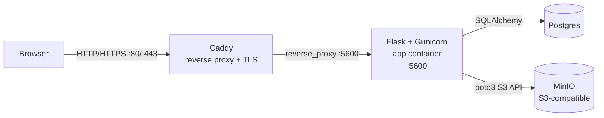

# Architecture

## Diagram

## Networking and exposure
- Caddy is the only public entrypoint and binds ports 80 and 443 on the host.
- The app listens on port 5600 inside the Docker network and is not published directly.
- Postgres (5432) and MinIO (9000/9001) are only exposed to the Docker network.
- Caddy routes all traffic to `app:5600` as configured in `docker/Caddyfile`.

## Persistence and volumes
- Postgres data persists in the `postgres_data` Docker volume.
- MinIO object data persists in the `minio_data` Docker volume.
- Caddy state and certificates are stored in `caddy_data` and `caddy_config`.

## Trust boundaries and secrets
- All secrets are provided via environment variables and `.env` (not committed).
- `SECRET_KEY` protects Flask session cookies and must be unique in production.
- Postgres and MinIO credentials should never be shared outside the Docker network.
- When `MEDIA_PROXY=1`, media requests flow through the app at `/media/*`.
- When `MEDIA_PROXY=0`, media URLs are presigned by MinIO and served directly.

## Request flow
- Browser sends a request to Caddy at the public domain.
- Caddy reverse-proxies to Gunicorn on the app container (port 5600).
- Flask routes the request to either HTML routes (`backend/routes.py`) or JSON APIs (`backend/api/*`).
- Services in `backend/services/` enforce business rules and orchestrate media lifecycle.
- Storage adapters in `backend/storage/` read/write to Postgres and MinIO.
- Responses return to the browser via Caddy.
