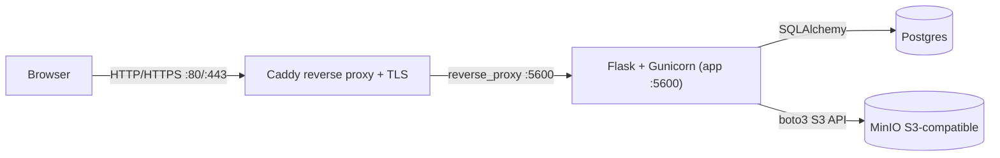
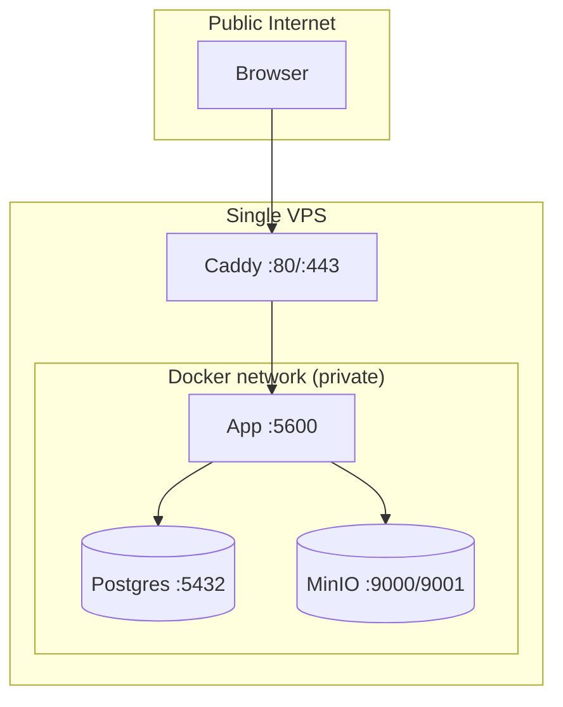

# Architecture

## Request flow

## Trust boundary

Caddy is the only host-bound process (ports 80/443). The app, Postgres, and MinIO are reachable only within the Docker network. Never publish Postgres or MinIO ports to the host.

## Layer boundaries

Requests flow through three strict layers. Each layer may only call the layer below it.

| Layer | Location | Responsibility |
|-------|----------|----------------|
| Routes / API | `backend/api/`, `backend/routes.py`, `backend/auth.py` | HTTP parsing, session checks, response shaping |
| Services | `backend/services/` | Business rules, authorization, orchestration |
| Storage | `backend/storage/` | Persistence via abstract adapters |

Routes must not touch storage directly. Services must not build HTTP responses.

## Storage adapter pattern

`backend/storage/base.py` defines abstract `QuestionStore`, `UserStore`, and `MediaStore`. Concrete implementations:

- `backend/storage/postgres.py` — current Postgres + MinIO path
- `backend/storage/minio.py` — MinIO media store
- `backend/storage/aws.py` — legacy DynamoDB/S3 adapters (migration tooling only)

`backend/storage/factory.py` selects the implementation via `get_question_store()` / `get_user_store()` / `get_media_store()` (all `lru_cache`d). Selection is controlled by `STORE_BACKEND`, `QUESTION_STORE`, `USER_STORE`, and `MEDIA_STORE` env vars.

## Persistence

| Data | Storage | Volume |
|------|---------|--------|
| Questions, users | Postgres | `postgres_data` |
| Media objects | MinIO | `minio_data` |
| TLS certs | Caddy | `caddy_data`, `caddy_config` |

## Media delivery

- `MEDIA_PROXY=1` (default): the app streams media at `GET /media/<key>`.
- `MEDIA_PROXY=0`: the store returns presigned MinIO URLs served directly by MinIO.

## Configuration

All configuration via environment variables. `backend/core/settings.py` (`get_settings()`, `lru_cache`d) reads from `.env` via `python-dotenv`. See `docs/08-environment-variables.md` for the full reference.
