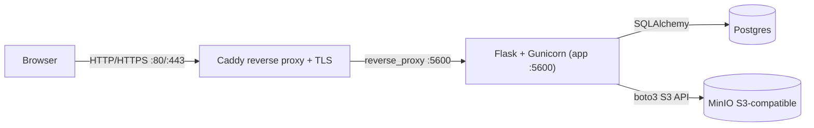

# Architecture

This page explains the running system in plain language, then shows the same idea in diagrams.

## Why this exists

If you understand how requests flow and where data lives, you can debug issues faster and make safer changes.

## Key concepts (quick definitions)

Why this exists: these terms are used throughout the docs, so this section gives you a short, shared vocabulary.

- **Reverse proxy**: a front door that receives web traffic and forwards it to the app. Here, Caddy is the reverse proxy.
- **Container network**: a private network created by Docker so containers can talk to each other by name.
- **Volume**: a persistent disk location managed by Docker so data survives container restarts.
- **TLS (HTTPS encryption)**: the certificate system that lets browsers trust your site.
- **S3-compatible storage**: an object store that speaks the same API as Amazon S3.

## Diagram: request flow

Why this exists: this shows the full path a browser request takes.



## Diagram: trust boundary

Why this exists: it shows what is public and what is private.

```mermaid
flowchart TB
    subgraph Public[Public Internet]
        Browser2[Browser]
    end

    subgraph VPS[Single VPS]
        Caddy2["Caddy :80/:443"]
        subgraph Docker[Docker network (private)]
            App2["App :5600"]
            Postgres2[("Postgres :5432")]
            MinIO2[("MinIO :9000/9001")]
        end
    end

    Browser2 --> Caddy2
    Caddy2 --> App2
    App2 --> Postgres2
    App2 --> MinIO2
```

Common beginner mistake: publishing Postgres or MinIO ports to the public internet. They should remain private to the Docker network.

## Networking and exposure

Why this exists: ports and exposure explain how traffic is allowed in.

- Caddy is the only public entrypoint and binds ports 80 and 443 on the host.
- The app listens on port 5600 inside the Docker network and is not published directly.
- Postgres (5432) and MinIO (9000/9001) are only reachable inside the Docker network.
- Caddy routes all traffic to `app:5600` as configured in `docker/Caddyfile`.

## Persistence and volumes

Why this exists: you need to know where data actually lives.

- Postgres data persists in the `postgres_data` Docker volume.
- MinIO object data persists in the `minio_data` Docker volume.
- Caddy state and certificates are stored in `caddy_data` and `caddy_config`.

Common beginner mistake: deleting volumes with `docker compose down -v` and losing all data.

## Trust boundaries and secrets

Why this exists: security depends on correct handling of secrets.

- All secrets are provided via environment variables and `.env`.
- `SECRET_KEY` protects Flask session cookies and must be unique in production.
- Postgres and MinIO credentials should never be shared outside the Docker network.
- When `MEDIA_PROXY=1`, media requests flow through the app at `/media/*`.
- When `MEDIA_PROXY=0`, media URLs are presigned and served directly by MinIO.

## Request flow (step-by-step)

Why this exists: understanding the order of steps helps you debug failures.

1. Browser sends a request to Caddy at the public domain.
2. Caddy forwards the request to Gunicorn on the app container (`app:5600`).
3. Flask routes the request to HTML pages (`backend/routes.py`) or JSON APIs (`backend/api/*`).
4. Services in `backend/services/` enforce business rules and orchestrate media lifecycle.
5. Storage adapters in `backend/storage/` read/write to Postgres and MinIO.
6. The response travels back through Caddy to the browser.
