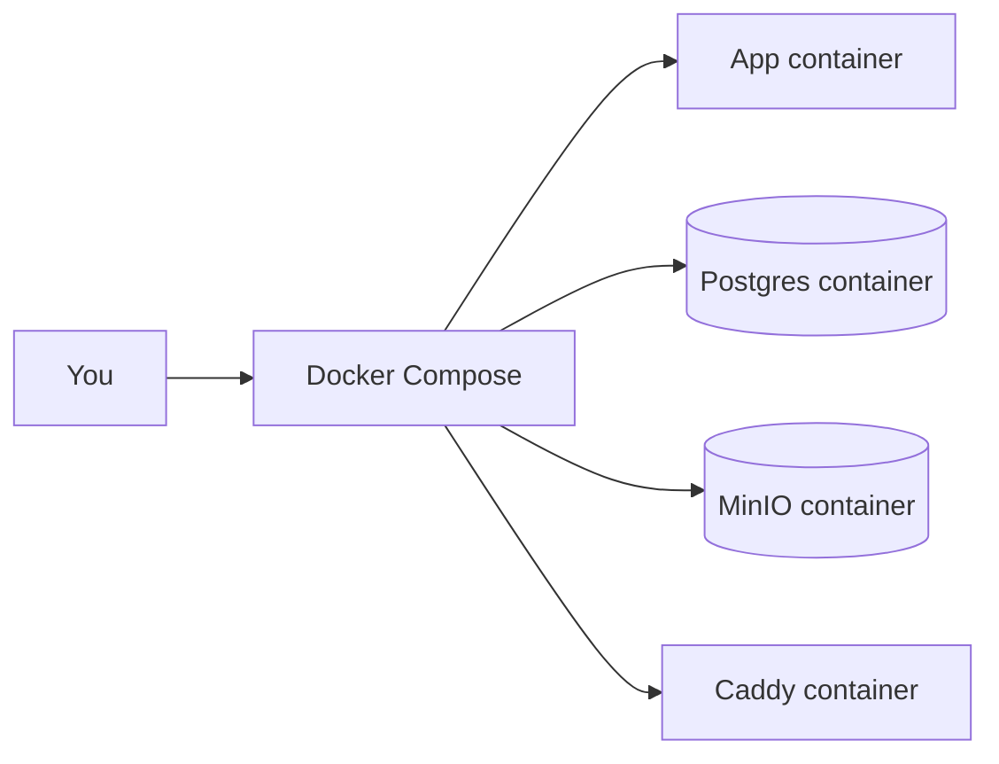

# Local development (Docker)
This guide runs the full stack on your laptop using Docker Compose. Docker Compose is a tool that starts multiple containers together as one stack.

## Why this exists
New contributors need a repeatable way to run the app without manually installing Postgres or MinIO.

## Prerequisites
Why this exists: these are the minimum tools you need to run the stack.

- Docker Desktop or Docker Engine with the Docker Compose plugin.
- A terminal that can run `docker compose` commands.

Common beginner mistake: installing Docker but not the Compose plugin. `docker compose` should work from your terminal.

## What Docker Compose creates
Why this exists: understanding the moving parts makes the logs and errors less scary.



## Local setup (step-by-step)
Why this exists: the exact steps below are tested against the current repository layout.

A migration is a scripted database change. You run it once to create the tables the app expects.

1. Create a local environment file.
   ```bash
   cp docker/app.env.example .env
   ```
   What this does: copies the example configuration into a `.env` file that Docker Compose reads.

2. Start the stack.
   ```bash
   docker compose -f docker/docker-compose.yml --env-file .env up -d
   ```
   What this does: builds and starts the containers in the background (`-d`).

3. Run database migrations.
   ```bash
   docker compose -f docker/docker-compose.yml --env-file .env run --rm app alembic upgrade head
   ```
   What this does: applies database schema changes to Postgres so tables exist.

4. (Optional) Create an admin user.
   ```bash
   docker compose -f docker/docker-compose.yml --env-file .env run --rm app \
     python scripts/ensure_admin.py --username admin --email admin@example.com --password "change-me"
   ```
   What this does: creates or promotes an admin account in the database.

5. Open the app at `http://localhost` (through Caddy). Then check `http://localhost/health`, which should return `{"status":"ok"}`.

Common beginner mistake: skipping migrations and then seeing `relation "questions" does not exist` in logs.

## Local run notes
Why this exists: these are the details that usually confuse new contributors.

- The Flask app listens on port 5600 inside Docker. You access it via Caddy at `http://localhost`.
- Postgres and MinIO are private to the Docker network unless you explicitly publish ports.
- `POSTGRES_AUTO_CREATE=1` auto-creates tables on startup, but migrations are safer and more repeatable.
- Media requests flow through the app when `MEDIA_PROXY=1` (default).

## Useful local commands
Why this exists: these commands help you inspect and manage the stack.

- View running services: `docker compose -f docker/docker-compose.yml --env-file .env ps`
  What this does: shows container status.
- Tail app logs: `docker compose -f docker/docker-compose.yml --env-file .env logs -f app`
  What this does: streams logs from the app container.
- Stop services: `docker compose -f docker/docker-compose.yml --env-file .env stop`
  What this does: stops containers without deleting data.
- Remove services: `docker compose -f docker/docker-compose.yml --env-file .env down`
  What this does: removes containers but keeps volumes by default.
