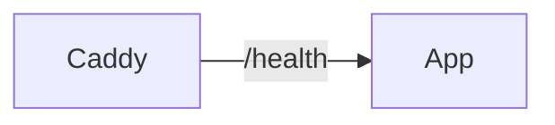

# Operations
This page covers day-to-day tasks: logs, health checks, secrets, and runtime inspection.

## Why this exists
Operators need fast ways to confirm the system is healthy and to diagnose issues without guessing.

## Logs
Why this exists: logs are the first place to look when something breaks.

- Tail app logs: `docker compose -f docker/docker-compose.yml --env-file .env logs -f app`
  What this does: streams the Flask/Gunicorn logs.
- Tail Postgres logs: `docker compose -f docker/docker-compose.yml --env-file .env logs -f postgres`
  What this does: shows database startup and query errors.
- Tail MinIO logs: `docker compose -f docker/docker-compose.yml --env-file .env logs -f minio`
  What this does: shows object storage errors.
- Tail Caddy logs: `docker compose -f docker/docker-compose.yml --env-file .env logs -f caddy`
  What this does: shows HTTPS and proxy issues.

Common beginner mistake: tailing only the app logs when the database is the real problem.

## Health checks
Why this exists: health checks tell you if the app is alive without manual browsing.



- The app exposes `GET /health` and returns `{"status":"ok"}` on success.
- For local Docker, use `http://localhost/health`.
- Docker uses the same endpoint to mark the app container as healthy.

## Secrets and configuration
Why this exists: most production failures are configuration mistakes.

- All configuration comes from environment variables (see `docs/08-environment-variables.md`).
- The app reads `.env` automatically for non-Docker local runs.
- Never commit `.env` or real secret values to the repository.

Common beginner mistake: setting `SECRET_KEY=default_secret_key` in production. Always change it.

## Admin access
Why this exists: if no admin user exists, you can lock yourself out of management pages.

- Create or promote an admin user:
  ```bash
  docker compose -f docker/docker-compose.yml --env-file .env run --rm app \
    python scripts/ensure_admin.py --username admin --email admin@example.com --password "change-me"
  ```
  What this does: creates or updates the admin user in the database.

## Media delivery
Why this exists: media URLs can be served in two different ways.

- `MEDIA_PROXY=1` (default): the app serves media via `/media/<key>`.
- `MEDIA_PROXY=0`: the app returns presigned MinIO URLs that the browser loads directly.

## Runtime inspection
Why this exists: sometimes you need to see the container environment in real time.

- View running containers: `docker compose -f docker/docker-compose.yml --env-file .env ps`
  What this does: shows container health and status.
- Open a shell in the app container: `docker compose -f docker/docker-compose.yml --env-file .env exec app /bin/sh`
  What this does: gives you a shell inside the container for debugging.
