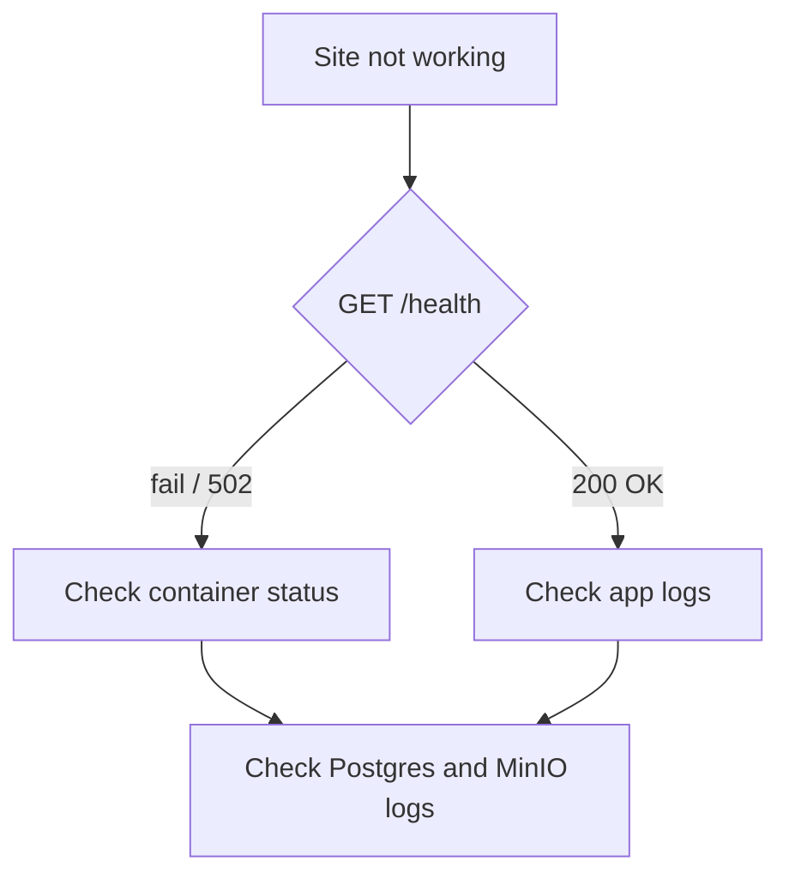

# Troubleshooting

## Debugging flow



## Common issues

| Symptom | Fix |
|---------|-----|
| Caddy returns 502 | Check app logs; ensure migrations ran; confirm Postgres and MinIO containers are healthy |
| Browser cannot reach site | Verify ports 80/443 are open; confirm `CADDY_DOMAIN` resolves to the VPS IP |
| Caddy certificate warning on first visit | Wait up to 5 minutes for Let's Encrypt to issue the certificate, then refresh |
| `relation "questions" does not exist` | Run `alembic upgrade head` |
| Media files fail to load | Verify `MINIO_ACCESS_KEY`, `MINIO_SECRET_KEY`, `MINIO_BUCKET`; if `MEDIA_PROXY=1`, check `/media/<key>` returns 200 |
| Login returns "Email verification required" or "Admin approval required" | Run `scripts/ensure_admin.py` to create or promote an admin |
| `.env` changes not applied | Restart containers: `docker compose ... up -d` |
| `docker: permission denied` | Log out and back in after `usermod -aG docker deploy` |
| Homepage shows "Loading…" forever | Check that questions exist with `review_status = true` in the database |
| Verification/reset emails not arriving | Check `SMTP_ENABLED=1` and SMTP credentials are correct; check app logs for `Failed to send email` errors; verify firewall allows outbound port 587/465 |
| "Too many attempts" / 429 on signup or verify | In-memory rate limiter triggered — wait and retry, or restart the app container to reset limits |
| Verification code expired | Codes expire after 15 minutes; use the resend-verification endpoint to get a fresh code |

## Quick diagnostics

```bash
# Container status and health
docker compose -f docker/docker-compose.yml --env-file .env ps

# Health endpoint
curl http://localhost/health

# Stream app logs
docker compose -f docker/docker-compose.yml --env-file .env logs -f app

# Shell into the app container
docker compose -f docker/docker-compose.yml --env-file .env exec app /bin/sh
```
