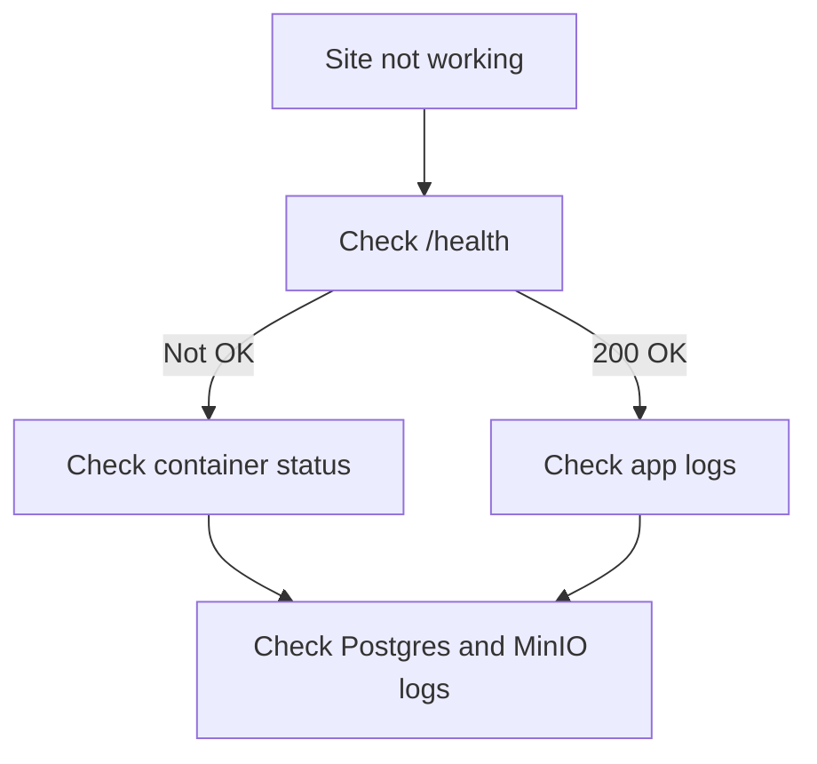

# Troubleshooting
This page lists common problems and the fastest way to diagnose them.

## Why this exists
When something breaks, you need a short checklist before diving into code.

## Quick debugging flow
Why this exists: a simple order of checks catches most issues.

## Common issues and fixes
Why this exists: these are the most frequent errors for new operators.

Issue: Caddy returns 502 or the app health check fails. Fix: check app logs (`docker compose -f docker/docker-compose.yml --env-file .env logs -f app`), ensure migrations ran (`docker compose -f docker/docker-compose.yml --env-file .env run --rm app alembic upgrade head`), and confirm Postgres and MinIO containers are healthy.

Issue: the browser cannot reach the site. Fix: verify ports 80 and 443 are open on the host and confirm `CADDY_DOMAIN` resolves to the VPS IP.

Issue: `relation "questions" does not exist` appears in logs. Fix: run Alembic migrations or set `POSTGRES_AUTO_CREATE=1` for local testing.

Issue: media files fail to load. Fix: confirm `MINIO_ACCESS_KEY`, `MINIO_SECRET_KEY`, and `MINIO_BUCKET` are correct. If using `MEDIA_PROXY=1`, verify `/media/<key>` returns 200. If using `MEDIA_PROXY=0`, ensure MinIO can generate presigned URLs and is reachable.

Issue: login returns `Email verification required` or `Admin approval required`. Fix: use `scripts/ensure_admin.py` to create or promote an admin user.

Issue: changes to `.env` do not apply. Fix: restart the stack with `docker compose -f docker/docker-compose.yml --env-file .env up -d`.

Common beginner mistake: editing `.env` and expecting running containers to update automatically.

## Quick diagnostics
Why this exists: these commands surface the state of the stack.

- Container status: `docker compose -f docker/docker-compose.yml --env-file .env ps` (shows container health and status)
- App health: `curl http://localhost/health` (checks the health endpoint directly)
- App logs: `docker compose -f docker/docker-compose.yml --env-file .env logs -f app` (streams app logs)
